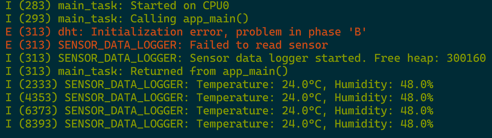

# ESP32 DHT Sensor Data Logger

This is an ESP-IDF project using a DHT11/DHT22 temperature and humidity sensor via the [esp-idf-lib](https://github.com/UncleRus/esp-idf-lib) library.

## 🌡️ Sensor Used

- DHT11/DHT22 (configured in code)
- Connected via a single GPIO (GPIO 27)

## 📦 Setup

Clone the repo:

```bash
git clone https://github.com/Inifomeeo/sensor-data-logger.git
cd sensor-data-logger
```

## Output


